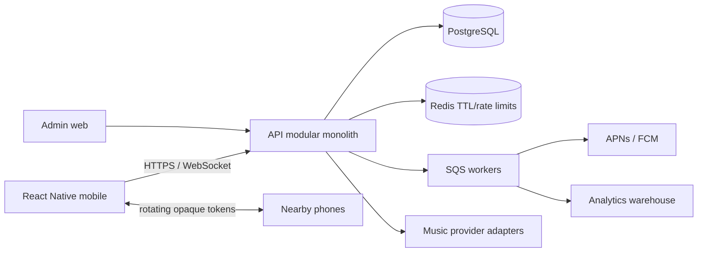
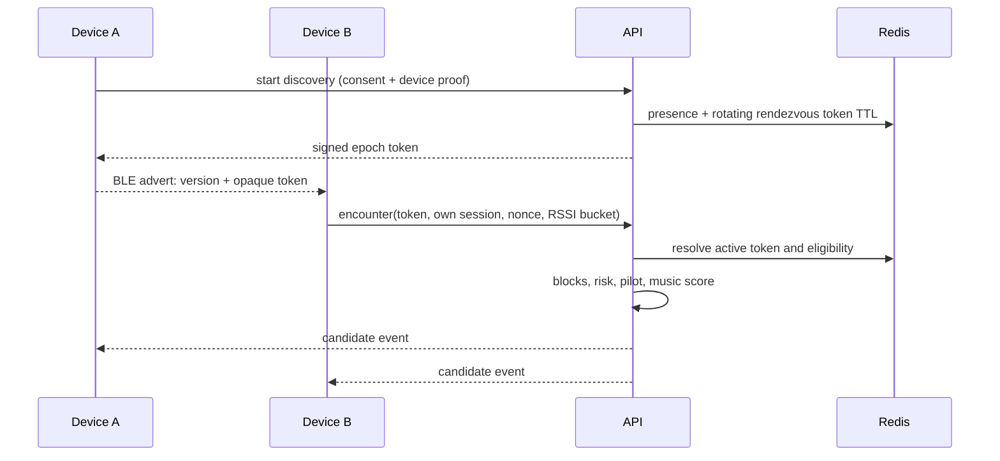

# System architecture

## Decision
A TypeScript modular monolith on AWS, PostgreSQL and Redis, with React Native mobile plus small native Swift/Kotlin proximity modules and a React admin console. This is the simplest architecture that preserves a later service split.

Modules: identity, profile, consent, music, presence, discovery, matching, connections, messaging, safety, notifications, pilot/events, analytics and admin. Each owns its tables and exposes an in-process typed port. No module reads another module's tables directly.

## Request and data boundaries
- API Gateway/WAF performs coarse rate limiting; application performs identity and resource authorization.
- Access token is short-lived; opaque refresh token rotates and is stored hashed with device/session metadata.
- PostgreSQL is authoritative for durable consent and connection state.
- Redis stores expiring presence, rendezvous-token lookup, candidate dedupe, WebSocket fan-out and rate counters. Presence is not reconstructed as location history.
- Outbox rows are committed with domain state, then workers publish notifications/analytics idempotently.
- Provider tokens use envelope encryption and are never returned to clients after exchange.

## Proximity sequence

## Scaling path
- **10K:** one API service, managed Postgres, small Redis, WebSocket nodes, SQS workers.
- **100K:** read replicas, table partitioning for events/messages, autoscaling, dedicated worker pools.
- **1M:** extract messaging and presence/discovery behind stable ports; regional WebSocket fan-out; Kafka/Kinesis if outbox throughput justifies it.
- **10M+:** regional cells, home-region routing, federated identity, geographically scoped presence, independent safety/analytics pipelines. Never create a global proximity table.

## Failure behavior
Redis loss pauses discovery but not accounts/connections. Provider outage preserves manual track picker. WebSocket loss falls back to push and cursor-based REST sync. Database failover makes writes unavailable rather than accepting unsafe transitions. Token mismatch/replay fails closed.

## Cloud map
AWS: CloudFront/WAF, API Gateway or ALB, ECS Fargate, RDS PostgreSQL, ElastiCache, SQS, S3, KMS, Secrets Manager, CloudWatch/OpenTelemetry, Cognito or another OIDC adapter. Terraform modules keep provider boundaries explicit.
