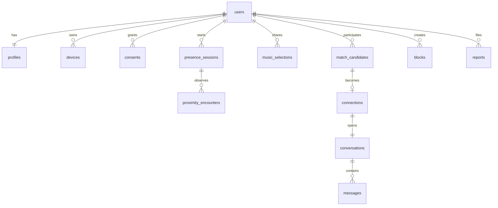

# Database schema

See `services/api/migrations/001_init.sql` for the executable MVP schema.

Hot queries are indexed by active presence expiry, candidate user/status/expiry, connection participant/state, conversation cursor, and moderation status. UUIDs prevent sequence enumeration. Message bodies are separate from analytics. Raw BLE tokens are HMAC-indexed and TTL-only in Redis, not durable rows.
